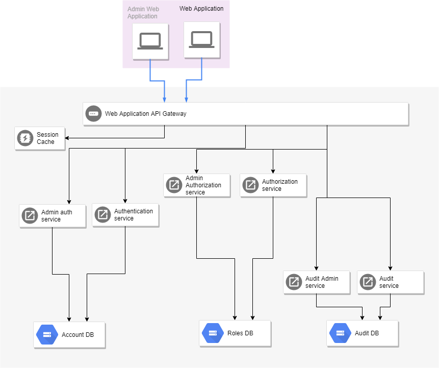

# *Roadmap*

Micro Services projects goal, architecture and to do list

This project is inspired by [The Twelve-Factor App](https://12factor.net/),
[Pattern: Microservice Architecture](https://microservices.io/patterns/microservices.html) and
my experience of developing enterprise applications.

## TO DO list

* Create set of simple projects (with basic functionality only) - Done!
* Add docker files (development environment) to the each one - Done!
* Add compose file for build and run this whole set on a local machine - Done!
* Publish those projects in Github - Done!
* Investigate and choice CI CD tool for a build, test and deploy - Done!
* Add CI file to each one.
* Create CI workflow (base unit tests for each one and e2e tests).
* Investigate and choose a platform for deployment.
* Implement CD to the chosen platform.
* Develop a log analyzer tool.
* Develop monitoring tool.
* Develop each one service to real service.
* Optimize containers - customize a docker image for sharing usage.
* Optimize CI CD processes.

## Architecture

-----

### Component's list

* A MongoDb database backed by a Docker volume
* A Redis database backed by a Docker volume
* A Node.js Proxy API
* A Node.js authentication admin service
* A Node.js authentication service
* A Node.js authorization admin service
* A Node.js authorization service
* A Node.js audit admin service
* A Node.js audit service
* A Node.js logging service
* A Node.js producer service
* A Node.js background worker service
* Example of An Angular front end SPA - it is not dockernazed.

### Folders structure

mcrsrv-postman
mcrsrv-curl
clients
  web-client
micro-services
  compose
  services
    authentication
    authentication-admin
    authorization
    authorization-admin
    audit
    audit-admin
    logging
    background
  gateways  
    web-app-api-gtw
    mobile-app-api-gtw
